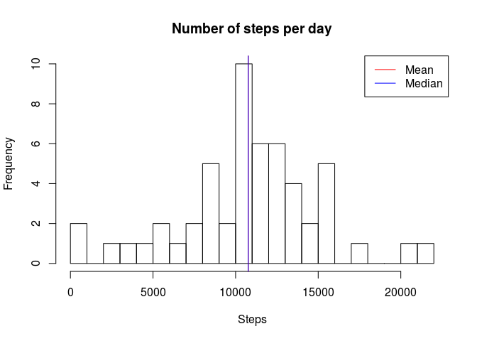
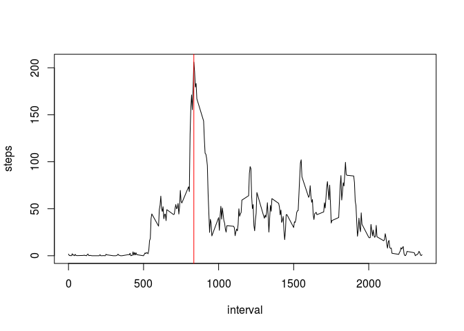
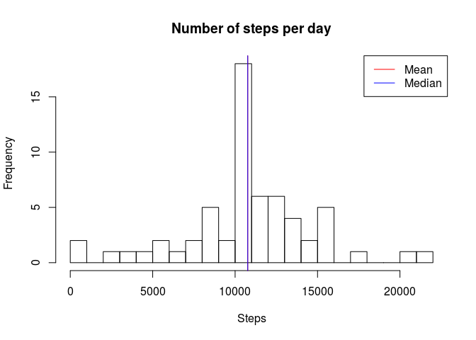
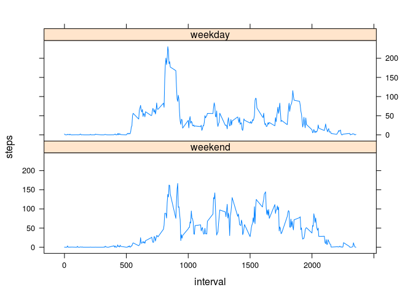

# Reproducible Research: Peer Assessment 1


## Loading and preprocessing the data


```r
setwd("~/Documents/Coursera/5 - Reproducible research/Assignment 1/RepData_PeerAssessment1")
data_raw <- read.csv("activity.csv")
data <- data_raw[complete.cases(data_raw),]
```

## What is mean total number of steps taken per day?


```r
library(dplyr)
```

```
## 
## Attaching package: 'dplyr'
## 
## The following object is masked from 'package:stats':
## 
##     filter
## 
## The following objects are masked from 'package:base':
## 
##     intersect, setdiff, setequal, union
```

```r
stepsbyday <- data %>% group_by(date) %>% summarize(steps= sum(steps))

hist(stepsbyday$steps,breaks=20, main= "Number of steps per day", xlab = "Steps")

abline(v=mean(stepsbyday$steps),col="red")
abline(v=median(stepsbyday$steps),col="blue")
legend("topright", c("Mean","Median"),lty=1, col=c("red","blue"))
```

 

The mean and the median are almost indistinguishable:

```r
mean(stepsbyday$steps)
```

```
## [1] 10766.19
```

```r
median(stepsbyday$steps)
```

```
## [1] 10765
```

## What is the average daily activity pattern?


```r
stepsbyhour <- data %>% group_by(interval) %>% summarize (steps = mean(steps))
```

The maximum is reached for the interval:

```r
maxi <-stepsbyhour$interval[which.max(stepsbyhour$steps)]
print(maxi)
```

```
## [1] 835
```

```r
plot(stepsbyhour, type = "l")
abline(v=maxi,col="red")
```

 

## Imputing missing values
Number and percentage of missing values:

```r
sum(is.na(data_raw$steps))
```

```
## [1] 2304
```

```r
sum(is.na(data_raw$steps)) / length(data_raw$steps) * 100
```

```
## [1] 13.11475
```

A look at the data shows that NA values come by entire days. We can then replace this missing days by an "average" day (computed previously in **stepsbyhour**).


```r
where <- which(is.na(data_raw$steps))

data_filled <- data_raw    # copy
for (i in where)
{
  missing_interval <- data_raw$interval[i]
  data_filled$steps[i] <-stepsbyhour$steps[ stepsbyhour$interval == missing_interval ]
}
```

Checking if it worked:

```r
head(data_raw)
```

```
##   steps       date interval
## 1    NA 2012-10-01        0
## 2    NA 2012-10-01        5
## 3    NA 2012-10-01       10
## 4    NA 2012-10-01       15
## 5    NA 2012-10-01       20
## 6    NA 2012-10-01       25
```

```r
head(data_filled)
```

```
##       steps       date interval
## 1 1.7169811 2012-10-01        0
## 2 0.3396226 2012-10-01        5
## 3 0.1320755 2012-10-01       10
## 4 0.1509434 2012-10-01       15
## 5 0.0754717 2012-10-01       20
## 6 2.0943396 2012-10-01       25
```
and if we didn't mess everything up:

```r
data_raw[1000:1010,]
```

```
##      steps       date interval
## 1000     0 2012-10-04     1115
## 1001     0 2012-10-04     1120
## 1002   180 2012-10-04     1125
## 1003    21 2012-10-04     1130
## 1004     0 2012-10-04     1135
## 1005     0 2012-10-04     1140
## 1006     0 2012-10-04     1145
## 1007     0 2012-10-04     1150
## 1008     0 2012-10-04     1155
## 1009   160 2012-10-04     1200
## 1010    79 2012-10-04     1205
```

```r
data_filled[1000:1010,]
```

```
##      steps       date interval
## 1000     0 2012-10-04     1115
## 1001     0 2012-10-04     1120
## 1002   180 2012-10-04     1125
## 1003    21 2012-10-04     1130
## 1004     0 2012-10-04     1135
## 1005     0 2012-10-04     1140
## 1006     0 2012-10-04     1145
## 1007     0 2012-10-04     1150
## 1008     0 2012-10-04     1155
## 1009   160 2012-10-04     1200
## 1010    79 2012-10-04     1205
```

Let's have a look at the new data:

```r
stepsbyday_filled <- data_filled %>% group_by(date) %>% summarize(steps= sum(steps))

hist(stepsbyday_filled$steps,breaks=20, main= "Number of steps per day", xlab = "Steps")

abline(v=mean(stepsbyday_filled$steps),col="red")
abline(v=median(stepsbyday_filled$steps),col="blue")
legend("topright", c("Mean","Median"),lty=1, col=c("red","blue"))
```

 

```r
mean(stepsbyday_filled$steps)
```

```
## [1] 10766.19
```

```r
median(stepsbyday_filled$steps)
```

```
## [1] 10766.19
```
As a reminder, dropping the NAs yielded:

```r
mean(stepsbyday$steps)
```

```
## [1] 10766.19
```

```r
median(stepsbyday$steps)
```

```
## [1] 10765
```

The mean hasn't moved at all: we only completed the previous data with an average day, preserving the mean.
The median has slightly changed and now equals the mean.


## Are there differences in activity patterns between weekdays and weekends?

My R install is in French so weekends are *samedi* (Saturday) and *dimanche* (Sunday):

```r
data_filled$daytype <- weekdays(as.Date(data_filled$date)) %in% c("samedi","dimanche")
data_filled$daytype <- factor(data_filled$daytype, levels=c("TRUE","FALSE"),label=c("weekend","weekday"))
```


```r
stepsbyhour_filled <- data_filled %>% group_by(daytype,interval) %>% summarize (steps = mean(steps))

library(lattice)
xyplot(steps~interval| daytype, stepsbyhour_filled, type="l", layout=c(1,2))
```

 

It looks like he wakes up early during the weekdays to go and sit all day long: he has an office job.
